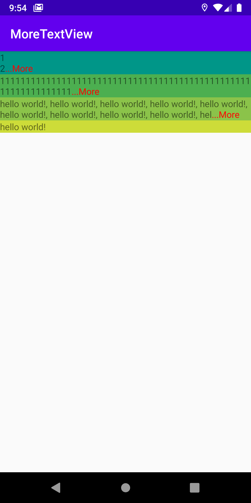
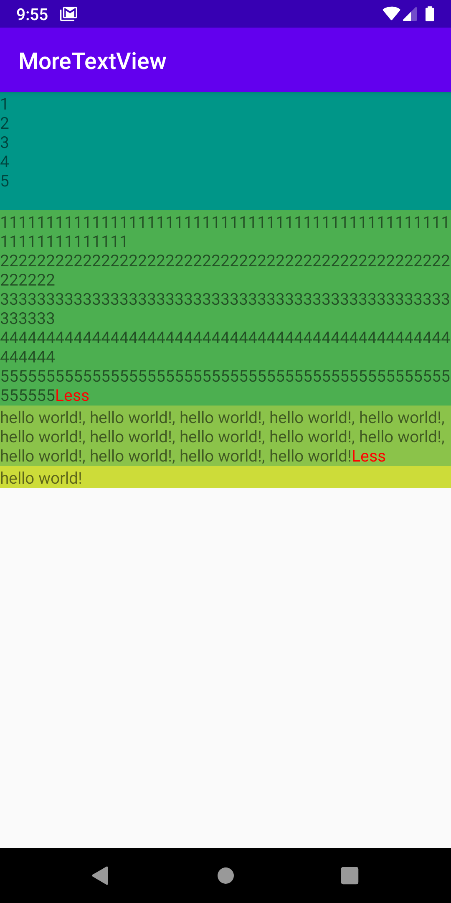

# MoreTextViewSample

텍스트뷰(TextView)에서 "...더보기" 를 구현한 MoreTextView입니다.

오픈소스를 찾아보다,  결국 구현하게 되었습니다.
텍스트에 "\n"이 있는 경우에도 잘 됩니다.

License : Acache 2.0 을 따릅니다.

## Screenshots

License
=======

    Copyright 2020 JeongHun Kim

    Licensed under the Apache License, Version 2.0 (the "License");
    you may not use this file except in compliance with the License.
    You may obtain a copy of the License at

       http://www.apache.org/licenses/LICENSE-2.0

    Unless required by applicable law or agreed to in writing, software
    distributed under the License is distributed on an "AS IS" BASIS,
    WITHOUT WARRANTIES OR CONDITIONS OF ANY KIND, either express or implied.
    See the License for the specific language governing permissions and
    limitations under the License.
